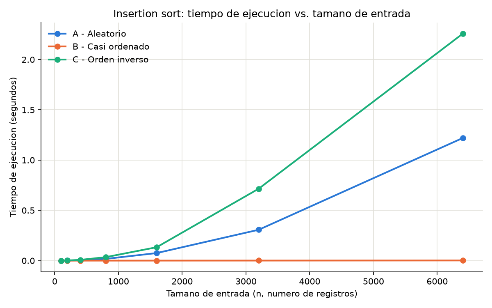
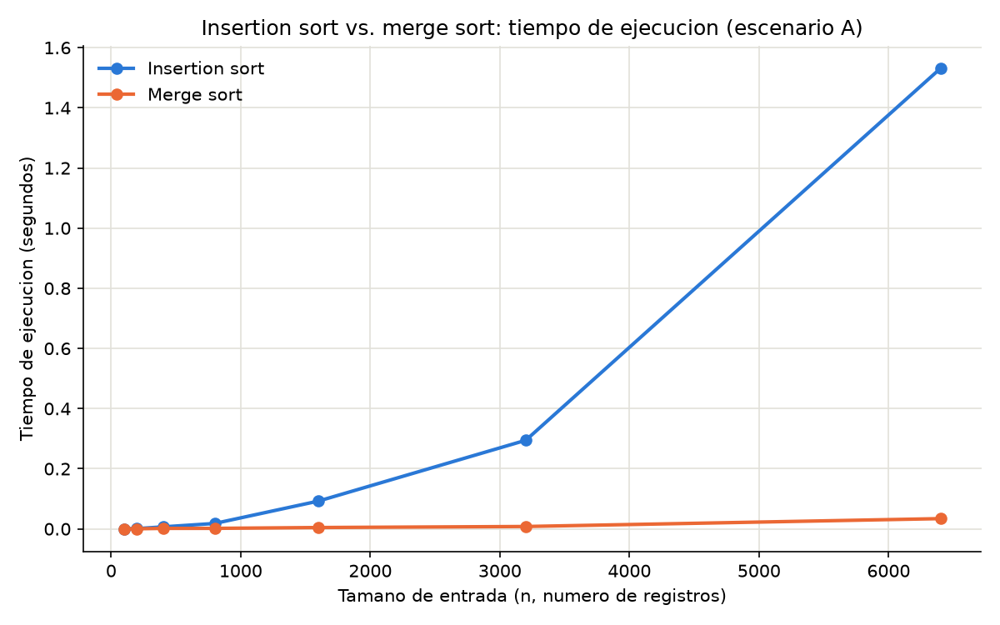

# Laboratorio evaluativo 01 — Fundamentos, complejidad y recurrencias

**Nombre:** Jhon Alejandro Isaza Pérez

## Instrucciones para reproducir el experimento

Desde la raíz del repositorio:

```bash
# 1. Activar el entorno virtual (Windows, Git Bash / PowerShell con venv en la raíz del repo)
source venv/Scripts/activate

# 2. Verificar dependencias (matplotlib ya está registrado en requirements.txt)
pip install -r requirements.txt

# 3. Ubicarse en la carpeta del laboratorio
cd curso-analisis-algoritmos/lab1-fundamentos-complejidad-recurrencias

# 4. Ejecutar el experimento de la Parte 3 (genera graficas/parte3_comparaciones.png y graficas/parte3_tiempo.png)
python parte3_casos.py

# 5. Ejecutar el experimento de la Parte 4 (genera graficas/parte4_tiempo.png)
python parte4_complejidad.py
```

Ambos scripts imprimen en consola el tiempo y las comparaciones medidas para cada tamaño de entrada, y guardan las gráficas en `graficas/`.

---

## Parte 1 — Analizar el algoritmo antes de comprar hardware

El hecho de que el sistema lleve ocho años entregando la lista de reabastecimiento correctamente no dice nada sobre si seguirá cabiendo en la ventana de 4 horas que tiene disponible. Significa que, si Tamiza Si ordena bien los 1.200.000 registros por indice dado cualquier lote de líneas de venta, el algoritmo produce la lista agrupada y ordenada. Eficiencia es otra cosa: significa que lleguen los resultados correctos dentro del tiempo que el negocio tiene disponible, en este caso antes de las 6:00 a.m., que es cuando abren. Un algoritmo puede ser perfectamente correcto y al mismo tiempo inviable si tarda más de lo que la operación puede esperar. La restricción concreta que aquí está en juego es esa ventana nocturna, si el ordenamiento la desborda, las listas salen incompletos, sin importar que el resultado hubiera sido el correcto.

Duplicar la velocidad del servidor no ataca esa causa porque no cambia cómo crece el trabajo del algoritmo cuando crecen los datos: si el ordenamiento es cuadrático, pasar de 450.000 a 900.000 líneas no duplica el tiempo, lo multiplica por cuatro. Un servidor el doble de rápido divide el tiempo por dos una sola vez; el crecimiento del problema se lo vuelve a comer en la siguiente expansión.

Un segundo ejemplo, de un proyecto personal: en una app de cotizaciones que hice para mis practicas, un endpoint recalculaba las similitudes entre mas de 50.000 usuarios cada vez que alguien abría la pantalla de inicio. El cálculo siempre daba el resultado correcto, pero la restricción que incumplía era de latencia: el navegador cortaba la petición a los 30 segundos, y con más de 20.000 usuarios el cálculo ya no alcanzaba a responder en ese tiempo.

---

## Parte 2 — Responsabilidad ambiental y ética de la implementación

Cada minuto adicional que el proceso de ordenamiento corre en el servidor es consumo eléctrico real, un consumo electrico que hoy por hoy en nuestro pais se ve tan afectado,  el servidor sostiene una carga de CPU alta durante ese tiempo. Como el proceso corre todas las noches, un algoritmo ineficiente no gasta esa energía una sola vez, la vuelve a gastar 365 veces al año, y ese consumo crece si se expander el servidor.

En el plano ético, si el proceso no termina a tiempo dos veces por semana, entonces el centro de contacto trabaja con una lista parcial no ordenada por riesgo, sin saber ¿que paciente de alto riego puede quedar sin llamar ese dia?, ¿quien queda con la responsabilidad de que la lista estaba incompleta si el secretario, el operador o el equipo de desarrollo que nunca reviso la complejidad del algoritmo?, tambien la trazabilidad de que si esta corriendo las otras veces entonces ya no hay que revisarlo.

---

## Parte 3 — Peor caso, mejor caso y caso promedio, demostrados en Python

Código de esta parte: [`parte3_casos.py`](parte3_casos.py), que usa las funciones instrumentadas de [`algoritmos.py`](algoritmos.py) y los generadores de escenarios de [`datos.py`](datos.py).

### 3.1 — Explicación

**Definiciones.**

- **Mejor caso:** para un tamaño de entrada `n` fijo, es el **mínimo** del tiempo (o del número de comparaciones) de insertion sort, tomado sobre **todas las posibles disposiciones de entrada de tamaño `n`**. No es "una entrada rápida cualquiera": es la entrada que, de todas las de tamaño `n`, produce el menor costo. Para insertion sort, esa entrada es la que ya viene ordenada de menor a mayor.
- **Peor caso:** para el mismo `n` fijo, es el **máximo** del tiempo (o comparaciones), tomado sobre el mismo conjunto de todas las entradas de tamaño `n`. Para insertion sort, esa entrada es la que viene en orden exactamente inverso.
- **Caso promedio:** para el mismo `n` fijo, es el **valor esperado** del tiempo (o comparaciones), promediado sobre una distribución de probabilidad asumida para las entradas de tamaño `n` (típicamente, todas las permutaciones de `n` elementos distintos con igual probabilidad). No es "un caso intermedio elegido a ojo": es un promedio matemático sobre ese conjunto de entradas.

**¿Cuál caso usar para decidir si Tamiza entra en producción?**

El **peor caso**. La ventana de cuatro horas es una restricción dura, no una expectativa: el centro de contacto abre a las 6:00 a.m. sin importar qué tan "típico" haya sido el lote de esa madrugada. Si Tamiza se dimensiona con el caso promedio y un día el lote llega en una disposición desfavorable (por ejemplo, una migración que llega en orden inverso, el escenario C), el proceso puede desbordar la ventana exactamente el día en que más importa. Diseñar para el peor caso es la única forma de dar una garantía —no una expectativa— de que el proceso siempre termine a tiempo.

**Predicción (antes de medir):**

Antes de realizar las mediciones, predigo que el escenario C será el peor caso, el escenario A será el mejor caso y el escenario B será el que más se aproxime al caso promedio. Espero que el escenario A sea el mejor caso porque los datos ya están ordenados de menor a mayor. En este caso, insertion sort solo necesita recorrer los elementos y comprobar que cada uno ya está en la posición correcta, por lo que realiza la menor cantidad posible de comparaciones y desplazamientos. El escenario C debería ser el peor caso porque los datos están ordenados exactamente al revés, enotnces para cada nuevo elemento, insertion sort debe desplazar una gran cantidad de elementos para poder colocarlo en su posición correcta, para esto el número de comparaciones y movimientos aumenta considerablemente a medida que crece n, llegando a un comportamiento de aproximadamente Θ(n²), y finalmente, espero que el escenario B se aproxime al caso promedio porque representa una disposición más desordenada de los datos. Al no estar los elementos completamente ordenados ni completamente invertidos, espero que la cantidad de comparaciones y desplazamientos se encuentre entre los valores de los escenarios A y C.

### 3.2 — Demostración experimental

Se ejecutó `insertion_sort` sobre los tres escenarios, para los tamaños de entrada `[100, 200, 400, 800, 1600, 3200, 6400]`. Resultados medidos:

| n | A · Aleatorio (comparaciones) | A · Aleatorio (s) | B · Casi ordenado (comparaciones) | B · Casi ordenado (s) | C · Orden inverso (comparaciones) | C · Orden inverso (s) |
|---:|---:|---:|---:|---:|---:|---:|
| 100 | 2 597 | 0.000262 | 100 | 0.000012 | 4 950 | 0.000456 |
| 200 | 10 318 | 0.000962 | 203 | 0.000021 | 19 900 | 0.001755 |
| 400 | 40 145 | 0.003634 | 417 | 0.000046 | 79 800 | 0.007255 |
| 800 | 160 699 | 0.017178 | 866 | 0.000114 | 319 600 | 0.034325 |
| 1600 | 633 904 | 0.075102 | 1 851 | 0.000273 | 1 279 200 | 0.133268 |
| 3200 | 2 591 685 | 0.306937 | 4 172 | 0.000550 | 5 118 400 | 0.715072 |
| 6400 | 10 212 819 | 1.219144 | 10 277 | 0.001645 | 20 476 800 | 2.256709 |




**Análisis.**

- El **escenario C (orden inverso)** es el peor caso: para `n = 6400` requiere más del doble de comparaciones que el escenario A (20 476 800 vs. 10 212 819) y casi el doble de tiempo. Cada elemento nuevo debe recorrer todo el prefijo ya ordenado antes de encontrar su lugar, porque siempre es el menor visto hasta el momento.
- El **escenario B (casi ordenado)** es el mejor caso observado: con el 98 % de la lista ya en el orden final, la mayoría de las inserciones no desplazan ningún elemento (`resultado[j] > actual` falla de inmediato). El número de comparaciones crece de forma prácticamente lineal con `n` (10 277 comparaciones para 6400 elementos, frente a los ~20.5 millones del escenario C), consistente con una complejidad cercana a Θ(n) en este caso.
- El **escenario A (aleatorio)** se aproxima al caso promedio: cada elemento nuevo recorre, en promedio, la mitad del prefijo ya ordenado, y sus comparaciones y tiempos quedan sistemáticamente entre B y C en todos los tamaños medidos.

**Contraste con la predicción de 3.1:**

Mi predicción coincidió parcialmente con los resultados experimentales, acerté al identificar el escenario C como el peor caso, ya que el orden inverso obliga a insertion sort a recorrer prácticamente para insertar cada nuevo elemento, esto se refleja en los resultados: para n = 6400, el escenario C realizó 20 476 800 comparaciones y tardó 2.256709 segundos, siendo el escenario con mayor costo.

Sin embargo, mi predicción sobre el mejor caso y el caso promedio no fue completamente correcta, había predicho que A sería el mejor caso y que B representaría el caso promedio. Los resultados muestran lo contrario: B es el mejor caso observado, mientras que A se aproxima al caso promedio.

Esto se explica porque el escenario B está casi completamente ordenado, aunque no es una lista perfectamente ordenada, el 98 % de sus elementos ya está en su posición final, por lo que insertion sort encuentra rápidamente que no necesita desplazar elementos en la mayoría de las inserciones. Por eso, para n = 6400, solo realiza 10 277 comparaciones y tarda 0.001645 segundos.

En cambio, en el escenario A, que contiene datos aleatorios, cada elemento tiene aproximadamente la misma probabilidad de encontrarse en distintas posiciones. En promedio, insertion sort debe recorrer una parte considerable de ese prefijo antes de encontrar la posición correcta. Por eso sus resultados quedan entre B y C y se comportan como una aproximación experimental al caso promedio.

La principal corrección a mi predicción inicial es que no se debe identificar simplemente el caso promedio con cualquier escenario que parezca "intermedio". El caso promedio depende de una distribución de entradas. En este experimento, el escenario A aleatorio es el que mejor representa esa distribución, mientras que B, al estar casi ordenado, se comporta como un caso favorable para insertion sort.

---

## Parte 4 — Complejidad de merge sort e insertion sort: cálculo y validación

Código de esta parte: [`parte4_complejidad.py`](parte4_complejidad.py), que usa `merge_sort` de [`algoritmos.py`](algoritmos.py) y el generador `generar_aleatorio` de [`datos.py`](datos.py).

### 4.1 — Cálculo teórico

#### Recurrencia de merge sort

Merge sort divide una lista de tamaño `n` en dos mitades, ordena cada mitad recursivamente y combina (mezcla) los dos resultados ordenados. Eso da la recurrencia:

```
T(n) = 2·T(n/2) + Θ(n)
```

- **`2·T(n/2)`**: se generan **2 subproblemas** (las dos mitades de la lista), cada uno de tamaño **n/2**, y cada uno se resuelve recursivamente con el mismo algoritmo.
- **`Θ(n)`**: es el costo de **combinar** (la función `_mezclar` en [`algoritmos.py`](algoritmos.py)): recorrer las dos mitades ya ordenadas y intercalarlas en una sola lista de `n` elementos toma un recorrido lineal, con exactamente una comparación por posición ocupada (en el peor caso) hasta que uno de los dos tramos se agota.
- Caso base: `T(1) = Θ(1)` (un tramo de un solo elemento ya está ordenado, `_dividir` retorna 0 comparaciones sin llamar a `_mezclar`).

#### Resolución por el método maestro

El método maestro aplica a recurrencias de la forma `T(n) = a·T(n/b) + f(n)`. Aquí:

- `a = 2` (dos llamadas recursivas)
- `b = 2` (cada una sobre la mitad del tamaño)
- `f(n) = Θ(n)` (costo de mezclar)

Se calcula `n^(log_b a) = n^(log_2 2) = n^1 = n`.

Comparando `f(n)` con `n^(log_b a)`:

```
f(n) = Θ(n) = Θ(n^(log_2 2) · log^0 n) = Θ(n^1)
```

`f(n)` es asintóticamente igual a `n^(log_b a)` (mismo orden, sin un factor logarítmico adicional en ninguno de los dos lados) → se cumple el **caso 2** del método maestro (`f(n) = Θ(n^(log_b a) · log^k n)` con `k = 0`), cuya conclusión es:

```
T(n) = Θ(n^(log_b a) · log^(k+1) n) = Θ(n · log n)
```

**Conclusión: `T(n) = Θ(n log n)` para merge sort**, en el peor, el mejor y el caso promedio (la recurrencia no depende de cómo estén ordenados los datos: siempre se generan las mismas dos mitades y siempre se recorre linealmente al mezclar).

#### Costo de insertion sort, línea a línea

Sobre la implementación real de `insertion_sort` en [`algoritmos.py`](algoritmos.py):

```python
def insertion_sort(datos):
    resultado = list(datos)                  # c1: 1 vez
    comparaciones = 0                         # c2: 1 vez

    for i in range(1, len(resultado)):        # c3: n veces
        actual = resultado[i]                 # c4: (n-1) veces
        j = i - 1                             # c5: (n-1) veces
        while j >= 0:                         # c6: sum_{i=1}^{n-1} (t_i + 1) veces
            comparaciones += 1                # c7: sum_{i=1}^{n-1} t_i veces
            if resultado[j] > actual:         # c8: sum_{i=1}^{n-1} t_i veces
                resultado[j + 1] = resultado[j]  # c9
                j -= 1                            # c10
            else:
                break                             # c11
        resultado[j + 1] = actual             # c12: (n-1) veces

    return resultado, comparaciones           # c13: 1 vez
```

donde `t_i` es el número de veces que el cuerpo del `while` se ejecuta en la iteración externa `i` (es decir, cuántas posiciones se desplaza el elemento `resultado[i]` hacia la izquierda). `t_i` varía entre `0` y `i`, dependiendo de qué tan desordenada esté la entrada.

- **Mejor caso** — entrada ya ordenada ascendentemente: `resultado[j] > actual` es falso de inmediato en cada `i`, así que `t_i = 0` para todo `i`. Solo se ejecutan las líneas `c3`–`c6` y `c12` (todas con costo lineal en `n`), y ninguna de `c7`–`c11`. El costo total es:
  ```
  T(n) = c3·n + (c4+c5+c6+c12)·(n-1) + c13 = O(n)
  ```
- **Peor caso** — entrada en orden inverso: cada elemento nuevo debe recorrer todo el prefijo ya ordenado, `t_i = i` para cada `i`. La suma de comparaciones es:
  ```
  sum_{i=1}^{n-1} t_i = sum_{i=1}^{n-1} i = n(n-1)/2 = O(n²)
  ```
  Como las líneas `c7` y `c8` se ejecutan ese número de veces (y son las de mayor peso), `T(n) = Θ(n²)`.
- **Caso promedio** — para una permutación aleatoria, se espera que cada elemento nuevo deba recorrer, en promedio, la mitad del prefijo ya ordenado: `t_i ≈ i/2`. La suma esperada es:
  ```
  sum_{i=1}^{n-1} i/2 = n(n-1)/4 = O(n²)
  ```
  El caso promedio tiene el mismo orden de crecimiento que el peor caso (Θ(n²)), solo con una constante menor (¼ en vez de ½ dentro del término cuadrático dominante) — es exactamente lo que se observa en la tabla de la Parte 3.2: el escenario A (aleatorio) tiene, para cada `n`, aproximadamente la mitad de las comparaciones del escenario C (orden inverso).

#### Tabla de complejidades esperadas

| Algoritmo | Mejor caso | Peor caso | Caso promedio |
|---|---|---|---|
| Insertion sort | Θ(n) | Θ(n²) | Θ(n²) |
| Merge sort | Θ(n log n) | Θ(n log n) | Θ(n log n) |

### 4.2 — Validación experimental

Se midió el tiempo de `insertion_sort` y `merge_sort` sobre el **escenario A** (aleatorio), para los mismos tamaños de entrada de la Parte 3:

| n | Insertion sort (s) | Merge sort (s) |
|---:|---:|---:|
| 100 | 0.000260 | 0.000174 |
| 200 | 0.001028 | 0.000392 |
| 400 | 0.006781 | 0.001717 |
| 800 | 0.018119 | 0.001817 |
| 1600 | 0.092545 | 0.004582 |
| 3200 | 0.294680 | 0.007990 |
| 6400 | 1.530898 | 0.034168 |



**Conclusión a partir de la gráfica.** La curva de insertion sort se dobla hacia arriba con una concavidad clara a medida que crece `n` —consistente con un crecimiento cuadrático—, mientras que la curva de merge sort se mantiene casi plana en la misma escala: entre `n = 100` y `n = 6400` (64 veces más datos), insertion sort tarda **~5 890 veces más** (de 0.00026 s a 1.53 s), mientras que merge sort tarda apenas **~196 veces más** (de 0.000174 s a 0.034 s). Para Tamiza, **merge sort es la mejor opción**: su tiempo crece de forma mucho más controlada al aumentar el volumen de registros.

**¿Coincide con la teoría de 4.1?** Sí. Θ(n²) crece por un factor de `64² = 4096` cuando `n` se multiplica por 64, y el crecimiento observado en insertion sort (~5890x) es del mismo orden de magnitud (la diferencia frente a 4096x se debe a que a `n` pequeño hay tiempos dominados por overhead fijo de Python, no solo por el bucle interno). Θ(n log n) crece por un factor de `64 · (log₂6400 / log₂100) ≈ 64 · 1.94 ≈ 124` cuando `n` se multiplica por 64, cercano al ~196x observado en merge sort — la diferencia se explica porque `merge_sort` es recursivo y en Python cada llamada de función tiene un costo fijo no despreciable, que pesa más para los tamaños pequeños de la muestra.

**Comportamiento a tamaños pequeños.** Para `n = 100`, merge sort ya es más rápido que insertion sort (0.000174 s vs. 0.00026 s) a pesar de que la teoría de sistemas de ordenamiento suele advertir que, para `n` muy pequeños, insertion sort puede ser competitivo por su bajo overhead por elemento; aquí no se observa ese cruce porque el overhead de las llamadas recursivas de `merge_sort` en Python, a estos tamaños, sigue siendo menor que las decenas de miles de comparaciones que insertion sort no necesita hacer cuando `n` es pequeño.

### 4.3 — Concepto técnico a la Secretaría de Salud

Recomiendo mantener el algoritmo de mezcla en producción y no el de inserción, porque su tiempo no depende de cómo lleguen ordenadas las listas que sí le afecta al de inserción si el canal de origen cambia, y porque el equipo no quiere sostener una implementación distinta por cada forma posible de llegada de datos. Con los tiempos medidos para n=6400 (0.03 s para el de mezcla frente a 1.53 s para el de inserción), y extrapolando el crecimiento observado hasta las 1.200.000 líneas reales, el de mezcla cabe con margen amplio dentro de la ventana nocturna; el de inserción, no. Frente a la propuesta de comprar un servidor más rápido, el dato mostrado ya evidencia una diferencia de más de 40 veces entre los dos algoritmos con el mismo hardware, una brecha que ningún servidor al doble de velocidad cierra.
