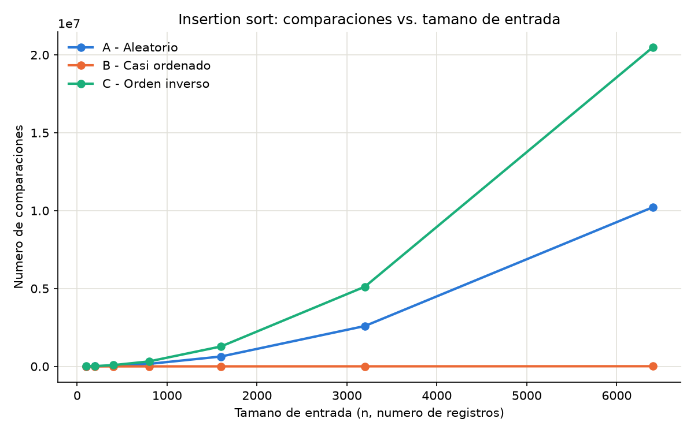
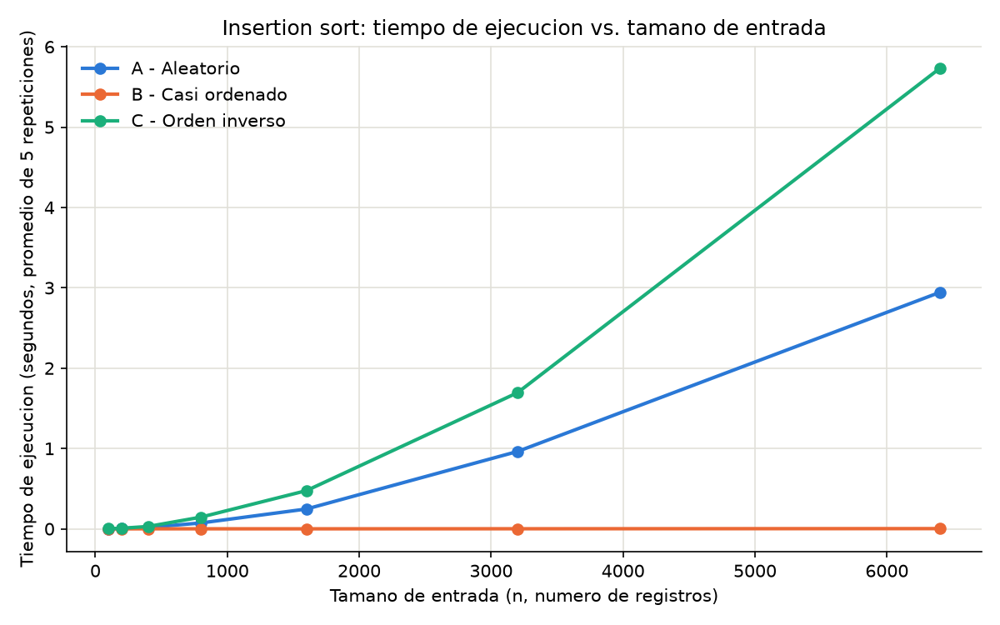
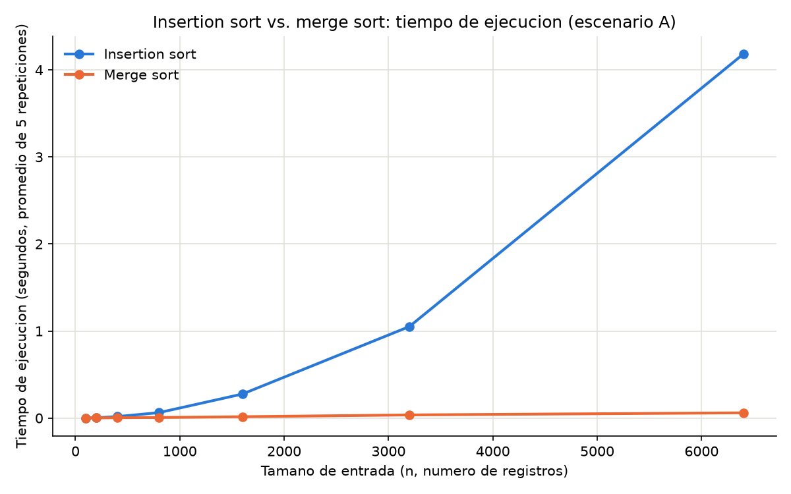

# Laboratorio evaluativo 01 — Fundamentos, complejidad y recurrencias

**Nombre:** Jhon Alejandro Isaza Pérez

## Instrucciones para reproducir el experimento

Desde la raíz del repositorio:

```bash
# 1. Activar el entorno virtual (Windows, Git Bash / PowerShell con venv en la raíz del repo)
source venv/Scripts/activate

# 2. Verificar dependencias (matplotlib ya está registrado en requirements.txt)
pip install -r requirements.txt

# 3. Ubicarse en la carpeta del laboratorio
cd curso-analisis-algoritmos/laboratorios/lab1-fundamentos-complejidad-recurrencias

# 4. Ejecutar el experimento de la Parte 3 (genera graficas/parte3_comparaciones.png y graficas/parte3_tiempo.png)
python parte3_casos.py

# 5. Ejecutar el experimento de la Parte 4 (genera graficas/parte4_tiempo.png)
python parte4_complejidad.py
```

Ambos scripts imprimen en consola el tiempo y las comparaciones medidas para cada tamaño de entrada, y guardan las gráficas en `graficas/`.

---

## Parte 1 — Analizar el algoritmo antes de comprar hardware

El hecho de que Tamiza lleve ocho años entregando la lista de llamadas correctamente no dice nada sobre si seguirá cabiendo en la ventana de cuatro horas que tiene disponible. Corrección significa que, dado cualquier lote de registros, el algoritmo produce la lista ordenada por índice de riesgo que corresponde — eso nunca ha fallado en Tamiza. Eficiencia es otra cosa: significa que ese resultado correcto se entrega dentro del tiempo que la operación tiene disponible, en este caso antes de las 6:00 a.m., que es cuando abre el centro de contacto. Un algoritmo puede ser perfectamente correcto y al mismo tiempo inviable si tarda más de lo que la operación puede esperar. La restricción concreta que aquí está en juego es la ventana nocturna de cuatro horas: si el ordenamiento la desborda, el centro de contacto empieza a llamar con una lista incompleta o desactualizada, sin importar que el resultado, cuando terminara, hubiera sido el correcto.

Duplicar la velocidad del servidor no ataca esa causa porque no cambia cómo crece el trabajo del algoritmo cuando crecen los datos: insertion sort es cuadrático, así que pasar de 600.000 a 1.200.000 registros no duplica el tiempo, lo multiplica por cuatro. Un servidor el doble de rápido divide el tiempo por dos una sola vez; el crecimiento del problema se lo vuelve a comer en la siguiente expansión del programa (más municipios, más laboratorios, más registros).

Un segundo ejemplo, de un proyecto personal: en una app de cotizaciones que hice para mis practicas, un endpoint recalculaba las similitudes entre mas de 50.000 usuarios cada vez que alguien abría la pantalla de inicio. El cálculo siempre daba el resultado correcto, pero la restricción que incumplía era de latencia: el navegador cortaba la petición a los 30 segundos, y con más de 20.000 usuarios el cálculo ya no alcanzaba a responder en ese tiempo.

---

## Parte 2 — Responsabilidad ambiental y ética de la implementación

Cada minuto adicional que el proceso de ordenamiento corre en el servidor es consumo eléctrico real: el servidor sostiene una carga de CPU alta durante ese tiempo, en un país donde la generación eléctrica ya está bajo presión. Como el proceso corre todas las madrugadas, un algoritmo ineficiente no gasta esa energía una sola vez: la vuelve a gastar 365 veces al año, y ese consumo se multiplica si el programa se expande a más municipios o si, para sostener la ventana, hay que ampliar el servidor.

En el plano ético, identifico al menos dos perjuicios concretos. El primero: si el proceso no termina a tiempo, el centro de contacto abre con una lista parcial, no ordenada por riesgo real; un paciente de alto riesgo que debía ser el primero en recibir la llamada puede quedar al final de esa lista parcial, o directamente sin ser llamado ese día, retrasando su valoración médica. El costo de ese error lo asume primero el paciente — no la Secretaría ni el equipo de desarrollo, que ni se enteran del faltante hasta días después, si acaso. El segundo: el operador del centro de contacto no tiene forma de saber que la lista con la que está trabajando está incompleta, y termina tomando decisiones de priorización (a quién llamar primero) sin la información completa que el sistema le debía entregar; si algo sale mal con un paciente que debió llamarse antes, el operador puede terminar respondiendo por un error que no es suyo, sino del algoritmo que nunca se revisó.

Hay además una tensión propia de este caso: el orden de la lista no es un detalle operativo, es lo que decide a quién se llama primero. Eso impone una obligación que va más allá del tiempo: no basta con que el ordenamiento termine dentro de la ventana, tiene que ser correcto en el sentido estricto del índice de riesgo, porque un error de orden —no solo un retraso— puede hacer que se llame primero a un paciente de bajo riesgo mientras uno de alto riesgo espera más de lo que su condición permite. Por eso la corrección importa aquí de una forma en que no importa, por ejemplo, al ordenar productos en una tienda en línea: ahí un orden ligeramente distinto no tiene consecuencias clínicas, aquí sí.

---

## Parte 3 — Peor caso, mejor caso y caso promedio, demostrados en Python

Código de esta parte: [`parte3_casos.py`](parte3_casos.py), que usa las funciones instrumentadas de [`algoritmos.py`](algoritmos.py) y los generadores de escenarios de [`datos.py`](datos.py).

**Nota sobre el sentido del orden.** Para simplificar la comparación entre escenarios y entre algoritmos, `insertion_sort`, `merge_sort` y los tres generadores de [`datos.py`](datos.py) ordenan de **menor a mayor** (ascendente). En producción, Tamiza necesita la lista de llamadas ordenada de **mayor a menor** índice de riesgo (descendente), para que el centro de contacto atienda primero a los pacientes de mayor riesgo. Ese cambio de sentido no altera la complejidad de ningún algoritmo analizado aquí: basta con invertir la lista resultante (costo adicional Θ(n)) o con invertir el sentido de la comparación dentro del algoritmo, sin modificar su orden de crecimiento.

### 3.1 — Explicación

**Definiciones.**

- **Mejor caso:** para un tamaño de entrada `n` fijo, es el **mínimo** del tiempo (o del número de comparaciones) de insertion sort, tomado sobre **todas las posibles disposiciones de entrada de tamaño `n`**. No es "una entrada rápida cualquiera": es la entrada que, de todas las de tamaño `n`, produce el menor costo. Para insertion sort, esa entrada es la que ya viene ordenada de menor a mayor.
- **Peor caso:** para el mismo `n` fijo, es el **máximo** del tiempo (o comparaciones), tomado sobre el mismo conjunto de todas las entradas de tamaño `n`. Para insertion sort, esa entrada es la que viene en orden exactamente inverso.
- **Caso promedio:** para el mismo `n` fijo, es el **valor esperado** del tiempo (o comparaciones), promediado sobre una distribución de probabilidad asumida para las entradas de tamaño `n` (típicamente, todas las permutaciones de `n` elementos distintos con igual probabilidad). No es "un caso intermedio elegido a ojo": es un promedio matemático sobre ese conjunto de entradas.

**¿Cuál caso usar para decidir si Tamiza entra en producción?**

El **peor caso**. La ventana de cuatro horas es una restricción dura, no una expectativa: el centro de contacto abre a las 6:00 a.m. sin importar qué tan "típico" haya sido el lote de esa madrugada. Si Tamiza se dimensiona con el caso promedio y un día el lote llega en una disposición desfavorable (por ejemplo, una migración que llega en orden inverso, el escenario C), el proceso puede desbordar la ventana exactamente el día en que más importa. Diseñar para el peor caso es la única forma de dar una garantía —no una expectativa— de que el proceso siempre termine a tiempo.

**Predicción (antes de medir):**

Antes de realizar las mediciones, predigo que el escenario C será el peor caso, el escenario A será el mejor caso y el escenario B será el que más se aproxime al caso promedio.

Espero que el escenario C sea el peor caso porque los datos están ordenados exactamente al revés: para cada nuevo elemento, insertion sort debe desplazar una gran cantidad de elementos para poder colocarlo en su posición correcta, por lo que el número de comparaciones y movimientos aumenta considerablemente a medida que crece n, llegando a un comportamiento de aproximadamente Θ(n²).

Espero que el escenario A sea el mejor caso porque, al generarse de forma aleatoria, asumo que en promedio cada elemento no quedará muy lejos de su posición final dentro del arreglo, por lo que insertion sort necesitaría pocos desplazamientos para ubicarlo.

Finalmente, espero que el escenario B se aproxime al caso promedio porque, aunque el 98 % de sus elementos ya está ordenado, el 2 % restante llega desordenado al final; ese pequeño porcentaje desordenado debería obligar a algunos desplazamientos adicionales, dejando su costo entre el de un escenario completamente ordenado y uno completamente invertido.

### 3.2 — Demostración experimental

Se ejecutó `insertion_sort` sobre los tres escenarios, para los tamaños de entrada `[100, 200, 400, 800, 1600, 3200, 6400]`. El número de comparaciones es determinístico para un lote dado y se registró una sola vez; el tiempo se midió 5 veces por combinación de escenario y tamaño, sobre el mismo lote, y se reporta el promedio. Resultados medidos:

| n | A · Aleatorio (comparaciones) | A · Aleatorio (s, prom. 5) | B · Casi ordenado (comparaciones) | B · Casi ordenado (s, prom. 5) | C · Orden inverso (comparaciones) | C · Orden inverso (s, prom. 5) |
|---:|---:|---:|---:|---:|---:|---:|
| 100 | 2 597 | 0.000709 | 100 | 0.000034 | 4 950 | 0.001404 |
| 200 | 10 318 | 0.004814 | 203 | 0.000070 | 19 900 | 0.007464 |
| 400 | 40 145 | 0.017391 | 417 | 0.000599 | 79 800 | 0.029665 |
| 800 | 160 699 | 0.073317 | 866 | 0.000682 | 319 600 | 0.145768 |
| 1600 | 633 904 | 0.246970 | 1 851 | 0.000475 | 1 279 200 | 0.475782 |
| 3200 | 2 591 685 | 0.963016 | 4 172 | 0.001115 | 5 118 400 | 1.694642 |
| 6400 | 10 212 819 | 2.942785 | 10 277 | 0.002910 | 20 476 800 | 5.730415 |



**Análisis de la gráfica de comparaciones (`parte3_comparaciones.png`).** Las tres curvas de comparaciones se separan desde los tamaños pequeños. En `n = 6400`, C acumula 20 476 800 comparaciones, poco más del doble que A (10 212 819), y cerca de 2000 veces más que B (10 277). La curva de B crece de forma casi plana y prácticamente lineal con `n`, mientras que A y C muestran la curvatura característica de un crecimiento cuadrático, con C siempre por encima de A en todos los tamaños medidos.



**Análisis de la gráfica de tiempo (`parte3_tiempo.png`).** La misma jerarquía se repite en tiempo de ejecución: en `n = 6400`, C tarda 5.730415 s, A tarda 2.942785 s (C es ~1.9 veces más lento que A) y B tarda apenas 0.002910 s (C es casi 2000 veces más lento que B). Al igual que en comparaciones, la curva de B es visualmente plana junto a las de A y C, y A se mantiene por debajo de C en cada tamaño medido. Que ambas gráficas —comparaciones y tiempo— ordenen a los tres escenarios exactamente igual confirma que el tiempo medido está dominado por el número de comparaciones, y no por ruido de medición u otro efecto.

- El **escenario C (orden inverso)** es el peor caso, tanto en comparaciones como en tiempo: cada elemento nuevo debe recorrer todo el prefijo ya ordenado antes de encontrar su lugar, porque siempre es el menor visto hasta el momento.
- El **escenario B (casi ordenado)** es el mejor caso observado: con el 98 % de la lista ya en el orden final, la mayoría de las inserciones no desplazan ningún elemento (`resultado[j] > actual` falla de inmediato), por lo que tanto sus comparaciones como su tiempo crecen de forma prácticamente lineal con `n`.
- El **escenario A (aleatorio)** se aproxima al caso promedio: cada elemento nuevo recorre, en promedio, la mitad del prefijo ya ordenado, y tanto sus comparaciones como sus tiempos quedan sistemáticamente entre B y C en todos los tamaños medidos.

**Contraste con la predicción de 3.1:**

Mi predicción coincidió parcialmente con los resultados experimentales: acerté al identificar el escenario C como el peor caso, ya que el orden inverso obliga a insertion sort a recorrer prácticamente todo el prefijo ya ordenado para insertar cada nuevo elemento. Esto se refleja en los resultados: para n = 6400, el escenario C realizó 20 476 800 comparaciones y tardó 5.730415 segundos, siendo el escenario con mayor costo.

Sin embargo, mi predicción sobre el mejor caso y el caso promedio no fue completamente correcta, había predicho que A sería el mejor caso y que B representaría el caso promedio. Los resultados muestran lo contrario: B es el mejor caso observado, mientras que A se aproxima al caso promedio.

Esto se explica porque el escenario B está casi completamente ordenado, aunque no es una lista perfectamente ordenada, el 98 % de sus elementos ya está en su posición final, por lo que insertion sort encuentra rápidamente que no necesita desplazar elementos en la mayoría de las inserciones. Por eso, para n = 6400, solo realiza 10 277 comparaciones y tarda 0.002910 segundos.

En cambio, en el escenario A, que contiene datos aleatorios, cada elemento tiene aproximadamente la misma probabilidad de encontrarse en distintas posiciones. En promedio, insertion sort debe recorrer una parte considerable de ese prefijo antes de encontrar la posición correcta. Por eso sus resultados quedan entre B y C y se comportan como una aproximación experimental al caso promedio.

La principal corrección a mi predicción inicial es que no se debe identificar simplemente el caso promedio con cualquier escenario que parezca "intermedio". El caso promedio depende de una distribución de entradas. En este experimento, el escenario A aleatorio es el que mejor representa esa distribución, mientras que B, al estar casi ordenado, se comporta como un caso favorable para insertion sort.

---

## Parte 4 — Complejidad de merge sort e insertion sort: cálculo y validación

Código de esta parte: [`parte4_complejidad.py`](parte4_complejidad.py), que usa `merge_sort` de [`algoritmos.py`](algoritmos.py) y el generador `generar_aleatorio` de [`datos.py`](datos.py).

### 4.1 — Cálculo teórico

#### Recurrencia de merge sort

Merge sort divide una lista de tamaño `n` en dos mitades, ordena cada mitad recursivamente y combina (mezcla) los dos resultados ordenados. Eso da la recurrencia:

```
T(n) = 2·T(n/2) + Θ(n)
```

- **`2·T(n/2)`**: se generan **2 subproblemas** (las dos mitades de la lista), cada uno de tamaño **n/2**, y cada uno se resuelve recursivamente con el mismo algoritmo.
- **`Θ(n)`**: es el costo de **combinar** (la función `_mezclar` en [`algoritmos.py`](algoritmos.py)): recorrer las dos mitades ya ordenadas y intercalarlas en una sola lista de `n` elementos toma un recorrido lineal, con exactamente una comparación por posición ocupada (en el peor caso) hasta que uno de los dos tramos se agota.
- Caso base: `T(1) = Θ(1)` (un tramo de un solo elemento ya está ordenado, `_dividir` retorna 0 comparaciones sin llamar a `_mezclar`).

#### Resolución por el método maestro

El método maestro aplica a recurrencias de la forma `T(n) = a·T(n/b) + f(n)`. Aquí:

- `a = 2` (dos llamadas recursivas)
- `b = 2` (cada una sobre la mitad del tamaño)
- `f(n) = Θ(n)` (costo de mezclar)

Se calcula `n^(log_b a) = n^(log_2 2) = n^1 = n`.

Comparando `f(n)` con `n^(log_b a)`:

```
f(n) = Θ(n) = Θ(n^(log_2 2) · log^0 n) = Θ(n^1)
```

`f(n)` es asintóticamente igual a `n^(log_b a)` (mismo orden, sin un factor logarítmico adicional en ninguno de los dos lados) → se cumple el **caso 2** del método maestro (`f(n) = Θ(n^(log_b a) · log^k n)` con `k = 0`), cuya conclusión es:

```
T(n) = Θ(n^(log_b a) · log^(k+1) n) = Θ(n · log n)
```

**Conclusión: `T(n) = Θ(n log n)` para merge sort**, en el peor, el mejor y el caso promedio (la recurrencia no depende de cómo estén ordenados los datos: siempre se generan las mismas dos mitades y siempre se recorre linealmente al mezclar).

#### Costo de insertion sort, línea a línea

Sobre la implementación real de `insertion_sort` en [`algoritmos.py`](algoritmos.py):

```python
def insertion_sort(datos):
    resultado = list(datos)                  # c1: 1 vez
    comparaciones = 0                         # c2: 1 vez

    for i in range(1, len(resultado)):        # c3: n veces
        actual = resultado[i]                 # c4: (n-1) veces
        j = i - 1                             # c5: (n-1) veces
        while j >= 0:                         # c6: sum_{i=1}^{n-1} (t_i + 1) veces
            comparaciones += 1                # c7: sum_{i=1}^{n-1} t_i veces
            if resultado[j] > actual:         # c8: sum_{i=1}^{n-1} t_i veces
                resultado[j + 1] = resultado[j]  # c9
                j -= 1                            # c10
            else:
                break                             # c11
        resultado[j + 1] = actual             # c12: (n-1) veces

    return resultado, comparaciones           # c13: 1 vez
```

donde `t_i` es el número de veces que el cuerpo del `while` se ejecuta en la iteración externa `i` (es decir, cuántas posiciones se desplaza el elemento `resultado[i]` hacia la izquierda). `t_i` varía entre `0` y `i`, dependiendo de qué tan desordenada esté la entrada.

- **Mejor caso** — entrada ya ordenada ascendentemente: `resultado[j] > actual` es falso de inmediato en cada `i`, así que `t_i = 0` para todo `i`. Solo se ejecutan las líneas `c3`–`c6` y `c12` (todas con costo lineal en `n`), y ninguna de `c7`–`c11`. El costo total es:
  ```
  T(n) = c3·n + (c4+c5+c6+c12)·(n-1) + c13 = O(n)
  ```
- **Peor caso** — entrada en orden inverso: cada elemento nuevo debe recorrer todo el prefijo ya ordenado, `t_i = i` para cada `i`. La suma de comparaciones es:
  ```
  sum_{i=1}^{n-1} t_i = sum_{i=1}^{n-1} i = n(n-1)/2 = O(n²)
  ```
  Como las líneas `c7` y `c8` se ejecutan ese número de veces (y son las de mayor peso), `T(n) = Θ(n²)`.
- **Caso promedio** — para una permutación aleatoria, se espera que cada elemento nuevo deba recorrer, en promedio, la mitad del prefijo ya ordenado: `t_i ≈ i/2`. La suma esperada es:
  ```
  sum_{i=1}^{n-1} i/2 = n(n-1)/4 = O(n²)
  ```
  El caso promedio tiene el mismo orden de crecimiento que el peor caso (Θ(n²)), solo con una constante menor (¼ en vez de ½ dentro del término cuadrático dominante) — es exactamente lo que se observa en la tabla de la Parte 3.2: el escenario A (aleatorio) tiene, para cada `n`, aproximadamente la mitad de las comparaciones del escenario C (orden inverso).

#### Tabla de complejidades esperadas

| Algoritmo | Mejor caso | Peor caso | Caso promedio |
|---|---|---|---|
| Insertion sort | Θ(n) | Θ(n²) | Θ(n²) |
| Merge sort | Θ(n log n) | Θ(n log n) | Θ(n log n) |

### 4.2 — Validación experimental

Se midió el tiempo de `insertion_sort` y `merge_sort` sobre el **escenario A** (aleatorio), para los mismos tamaños de entrada de la Parte 3. Cada medición se repitió 5 veces sobre el mismo lote y se reporta el promedio:

| n | Insertion sort (s, prom. 5) | Merge sort (s, prom. 5) |
|---:|---:|---:|
| 100 | 0.000894 | 0.000383 |
| 200 | 0.003540 | 0.001306 |
| 400 | 0.016861 | 0.004086 |
| 800 | 0.061975 | 0.006336 |
| 1600 | 0.275694 | 0.015135 |
| 3200 | 1.051115 | 0.035765 |
| 6400 | 4.181672 | 0.059865 |



**Conclusión a partir de la gráfica.** La curva de insertion sort se dobla hacia arriba con una concavidad clara a medida que crece `n` —consistente con un crecimiento cuadrático—, mientras que la curva de merge sort se mantiene casi plana en la misma escala: entre `n = 100` y `n = 6400` (64 veces más datos), insertion sort tarda **~4 677 veces más** (de 0.000894 s a 4.181672 s), mientras que merge sort tarda apenas **~156 veces más** (de 0.000383 s a 0.059865 s). Para Tamiza, **merge sort es la mejor opción**: su tiempo crece de forma mucho más controlada al aumentar el volumen de registros.

**¿Coincide con la teoría de 4.1?** Sí. Θ(n²) crece por un factor de `64² = 4096` cuando `n` se multiplica por 64, y el crecimiento observado en insertion sort (~4677x) es del mismo orden de magnitud (la diferencia frente a 4096x se debe a que a `n` pequeño hay tiempos dominados por overhead fijo de Python, no solo por el bucle interno). Θ(n log n) crece por un factor de `64 · (log₂6400 / log₂100) ≈ 64 · 1.90 ≈ 122` cuando `n` se multiplica por 64, cercano al ~156x observado en merge sort — la diferencia se explica porque `merge_sort` es recursivo y en Python cada llamada de función tiene un costo fijo no despreciable, que pesa más para los tamaños pequeños de la muestra.

**Comportamiento a tamaños pequeños.** Para `n = 100`, merge sort ya es más rápido que insertion sort (0.000383 s vs. 0.000894 s, ~2.3 veces) a pesar de que la teoría de sistemas de ordenamiento suele advertir que, para `n` muy pequeños, insertion sort puede ser competitivo por su bajo overhead por elemento; aquí no se observa ese cruce porque el overhead de las llamadas recursivas de `merge_sort` en Python, a estos tamaños, sigue siendo menor que las decenas de miles de comparaciones que insertion sort no necesita hacer cuando `n` es pequeño.

### 4.3 — Concepto técnico a la Secretaría de Salud

Recomendamos migrar el ordenamiento nocturno de Tamiza de insertion sort a merge sort, y mantener esa única implementación sin importar el canal de origen del lote. La razón no es solo de velocidad: merge sort divide el problema siempre en dos mitades iguales y las combina con un recorrido lineal, por lo que su costo es Θ(n log n) sin importar cómo vengan ordenados los registros. Insertion sort, en cambio, depende fuertemente del orden de entrada: en nuestras mediciones (ver [`graficas/parte3_tiempo.png`](graficas/parte3_tiempo.png)), el escenario C (orden inverso, el mismo patrón que produce la migración del sistema legado) le toma casi el doble de tiempo que el aleatorio, y casi 2000 veces más que un lote ya ordenado. Como el canal de origen puede cambiar sin aviso, un algoritmo cuyo desempeño depende del tipo de entrada obliga a vigilar constantemente qué canal está activo; merge sort elimina esa dependencia y evita mantener rutas de código distintas por escenario.

Para estimar si el proceso cabe en la ventana de cuatro horas (14 400 s) con los 1 200 000 registros reales, extrapolamos desde nuestras mediciones del escenario aleatorio en [`graficas/parte4_tiempo.png`](graficas/parte4_tiempo.png). Insertion sort, en n=3200 (1.051115 s) y n=6400 (4.181672 s), es consistente con T(n) ≈ 1.02×10⁻⁷·n²; extrapolado a n=1 200 000 da ≈147 000 s, cerca de 41 horas. Esto es una **estimación por extrapolación, no una medición directa** —nadie ejecutó insertion sort con 1.2 millones de registros aquí—, pero el orden de magnitud (más de diez veces la ventana) coincide con las fallas que la Secretaría ya reportó. Merge sort, con los mismos dos puntos (0.035765 s y 0.059865 s), es consistente con un costo de ≈7–9×10⁻⁷ s por cada n·log₂(n); extrapolado a n=1 200 000 (log₂n ≈ 20.2) da entre 18 y 21 segundos, muy por debajo de la ventana. Ambas cifras son estimaciones basadas en la tendencia medida, no mediciones directas sobre el volumen real.

Frente a comprar un servidor del doble de velocidad: aplicado solo a insertion sort, dividiría el tiempo estimado por dos (de ~41 a ~20 horas), que sigue superando por mucho la ventana de cuatro horas. El dato medido en n=6400 ([`graficas/parte4_tiempo.png`](graficas/parte4_tiempo.png)) ya muestra que merge sort es ≈70 veces más rápido que insertion sort con el mismo hardware (4.181672 s frente a 0.059865 s) — una brecha que ningún servidor al doble de velocidad cierra, porque el problema no es la velocidad del procesador sino cómo crece el trabajo del algoritmo. Recomendamos invertir ese presupuesto en otra prioridad.

Más allá del tiempo: merge sort usa memoria adicional proporcional a n en cada mezcla (las listas temporales `izquierda` y `derecha` de `_mezclar`, en [`algoritmos.py`](algoritmos.py)); para 1 200 000 enteros esa memoria extra es de unos pocos megabytes, insignificante para un servidor de producción. Ambas implementaciones son estables, así que el cambio no altera el orden relativo de registros con el mismo índice de riesgo. Por último, no conviene depender de que el escenario B (casi ordenado) siga siendo la norma: si el flujo de reproceso cambia, insertion sort perdería su única condición favorable, mientras que merge sort seguiría rindiendo igual.
